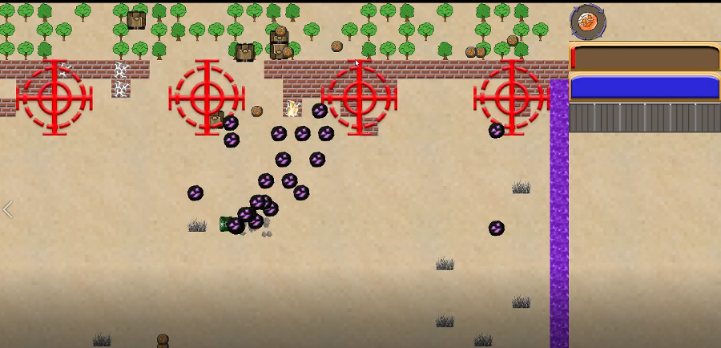

# 迷失的坦克 - Lost In World War II

这是一个基于 **C++ + Qt + OpenGL** 独立开发的坦克大战重制与扩展游戏。项目结合了童年经典游戏的怀旧风格，加入了全新的剧情模式、技能系统以及局域网联机玩法，是一次对底层开发能力与创意表达的深度实践。

> 本 README 基于原设计说明书撰写。

Table 

## 目录

- [项目简介](#项目简介)
- [核心功能](#核心功能)
- [游戏模式](#游戏模式)
- [技术栈](#技术栈)
- [安装方式](#安装方式)
- [使用说明](#使用说明)
- [演示截图](#演示截图)
- [开发计划](#开发计划)
- [贡献方式](#贡献方式)
- [许可证](#许可证)
- [English Version](#english-version)

---

## 项目简介

《迷失的坦克》灵感来源于童年对“坦克大战”游戏的热爱。该项目旨在使用现代 C++ 与 Qt 技术，重构并扩展经典玩法，增加更丰富的技能系统、敌人 AI、多人联机模式等，提升游戏性和趣味性。

核心亮点包括：

- **完整剧情模式**：背景故事 + 任务推进 + Boss 战。
- **局域网多人联机**：支持合作闯关或 PvP 模式。
- **自定义地图编辑器**：可视化 DIY 地图并保存。
- **复古像素画风结合 OpenGL 动画优化**。

---

## 核心功能

1. **两大核心模式**
   - **剧情模式**：含过场对白与任务推进。
   - **战斗模式**：传统坦克大战玩法，自由挑战关卡。

2. **三种武器技能**
   - **主炮**：经典炮弹。
   - **散弹**：360° 范围攻击。
   - **火焰喷射器**：近战范围持续高伤技能。

3. **丰富的互动元素**
   - 各类地图元素（丛林、地刺、冰面等）。
   - 急救包、武器箱等拾取类物品。
   - 轰炸区、粒子特效等视觉反馈。

4. **敌人 AI 行为**
   - 多种敌人类型：不同射击/移动模式。
   - 简易 AI：基于与玩家距离判断朝向。

5. **局域网联机机制**
   - 使用 Qt 的 `QUdpSocket` 广播协议实现。
   - 服务器负责所有战斗逻辑计算。
   - 客户端接收坐标/状态数据，进行渲染。

6. **地图编辑系统**
   - GUI 界面编辑地图，支持保存为 .txt 格式。
   - 快速测试关卡并导入游戏中。

---

## 游戏模式

- **剧情模式**：通过任务推进主线故事，最终击败 Boss。
- **闯关模式**：无剧情干扰，自由挑战敌人波次。
- **联机模式**：局域网内多人游戏，支持 PVE 与 PVP。

---

## 技术栈

- **开发语言**：C++（面向对象 + 自定义数据结构）
- **框架/工具**
  - Qt 5.14.2（界面、网络、计时、图像处理）
  - QOpenGLWidget（渲染优化）
  - qmake（构建工具）

- **美术与音频**
  - Adobe Photoshop CC（图像设计）
  - 格式工厂（音效格式转换）
  - 免费素材来源：
    - [kenney.nl](https://kenney.nl/assets)
    - [game-icons.net](https://game-icons.net/)
    - [craftpix.net](https://craftpix.net/)

---

## 安装方式

1. **下载游戏安装包**  
   从 GitHub 项目页面获取可执行文件或安装包：  
   [项目地址](https://github.com/NPgreatest/Lost-In-World-War-II)

2. **运行安装程序**  
   - 双击 `.exe` 文件开始安装。
   - 选择语言（支持 English）。
   - 点击 Install 完成安装流程。

3. **启动游戏**  
   - 默认勾选创建桌面快捷方式。
   - 点击 Finish 即可自动启动游戏。

---

## 使用说明

1. **单人模式**
   - 键盘控制坦克移动（WASD / 方向键）。
   - 鼠标用于瞄准与释放散弹技能。
   - Space 或 Shift 释放火焰喷射器（可自定义）。

2. **多人模式**
   - 选择 “联机游戏” 模式。
   - 一台电脑开启服务器，其余选择加入局域网房间。
   - 所有玩家共享战场环境，可协作或对战。

3. **地图编辑器**
   - 主界面中选择 “地图编辑”。
   - 拖拽方块、道具、敌人，自定义地图。
   - 保存为 `.txt` 文件供游戏读取。

---

## 演示截图

> 以下是示意图，请替换为真实截图或动图。

1. **主界面**  
   

2. **战斗画面**  
   

3. **地图编辑器**  
   

---

## 开发计划

**短期目标：**

- 修复局域网同步中存在的 Bug。
- 优化敌人 AI 路径计算。

**长期规划：**

- 将项目移植至 Unity / Unreal 以支持更强的表现力。
- 添加线上联机（非局域网）功能。
- 制作更完整的剧情动画与过场。
- 增加 Shader 特效提升画面表现。

---

## 贡献方式

欢迎贡献代码与创意！

- Fork 本仓库并提交 Pull Request。
- 分享你自定义的地图设计（`.txt` 文件）。
- 提 Issue 报告问题或建议新特性。

GitHub 项目地址：  
[https://github.com/NPgreatest/Lost-In-World-War-II](https://github.com/NPgreatest/Lost-In-World-War-II)

---

## 许可证

本项目仅用于学习与展示用途，部分资源来源于公开授权素材库。请勿直接商用。如需授权详情，请查看仓库内 LICENSE 文件及引用列表。

---

## English Version

Click here to view the [**English README**](./README.md)

---

感谢你体验《迷失的坦克》！如果你喜欢这个复古与现代结合的 C++ 游戏项目，欢迎 Star、反馈、或加入开发！

---
